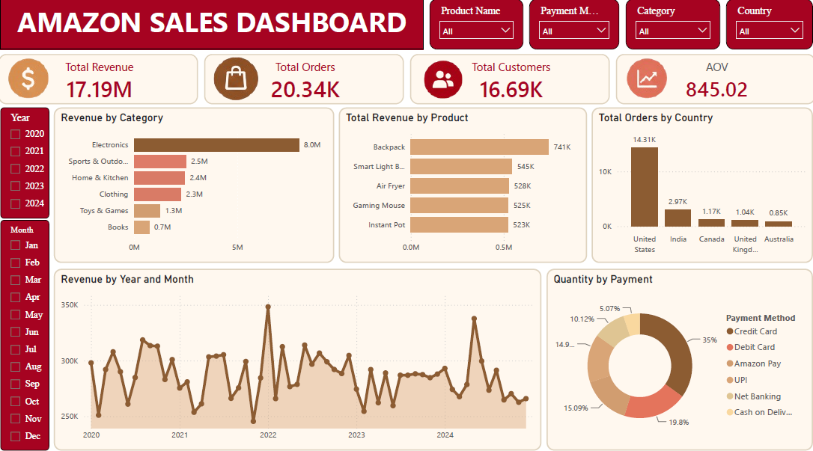

# Amazon Sales Analysis
Amazon E-commerce Sales Analysis using Excel and Power BI
## Project Overview
This project analyst Amazon e-commerce transaction data sourced from Kaggle
to evaluate sales performance, product performance, customer activity,
and geographic sales patterns.

The analysis covers the end-to-end process from data cleaning and
preparation to KPI development and interactive dashboard creation
using Power BI.

## Business Questions
This analysis aims to answer the following questions:

1. How does Amazon's sales performance change over time?
2. Which product categories and products contribute the most to revenue?
3. Which countries contribute the largest share of sales?
4. How do order volume and Average Order Value influence revenue performance?

## Dataset
The dataset used in this project was obtained from Kaggle.

### Dataset Information
| Item | Description |
|------|-------------|
| Source | Kaggle |
| Type | E-commerce transaction data |
| Records | XX,XXX |
| Period | XXXX–XXXX |
| Unit of Analysis | Order / Order Item |

## Data Cleaning
The dataset was cleaned and validated using Microsoft Excel.

The main cleaning steps included:

- Removing blank rows
- Checking missing values
- Validating duplicate records
- Standardizing date formats
- Checking numerical values
- Removing anomali dataset

## Analytical Approach
The analysis was conducted through the following workflow:

1. Data Cleaning
2. Data Validation
3. KPI Development
4. Sales Trend Analysis
5. Category Analysis
6. Product Analysis
7. Country Analysis
8. Dashboard Development
9. Business Insight Generation

## Key Metrics
The dashboard includes the following key performance indicators:

- Total Revenue
- Total Orders
- Total Customers
- Average Order Value (AOV)
- Total Quantity Sold

### Average Order Value
AOV is calculated as:
AOV = Total Revenue / Total Orders

## Dashboard
The following Power BI dashboard provides an interactive overview
of Amazon sales performance, including revenue, orders, customers,
AOV, sales trends, category performance, product performance,
and geographic sales distribution.

  

## Key Insights
### 1. Revenue Performance
Revenue shows an upward/downward trend across the analyzed period,
with the highest performance occurring in [period].

### 2. Category Performance
[Category] contributes the largest share of total revenue,
indicating its importance to overall sales performance.

### 3. Order Value
Changes in revenue are influenced not only by order volume but also
by changes in Average Order Value.

### 4. Geographic Performance
[Country] contributes the largest revenue share, while
[Country] demonstrates a relatively higher AOV.

## Business Recommendations
Based on the analysis, the following recommendations are proposed:
- Maintain inventory availability for high-performing categories.
- Explore bundling and cross-selling strategies to increase AOV.
- Evaluate high-potential markets with strong customer value.
- Monitor sales trends to support promotional and inventory planning.

## Tools
- Microsoft Excel — Data Cleaning
- Power BI — Data Visualization and Dashboard

## Project Files
